<h2>Compte rendu</h2>
<h3> Voici l'architecture de mon projet</h3>
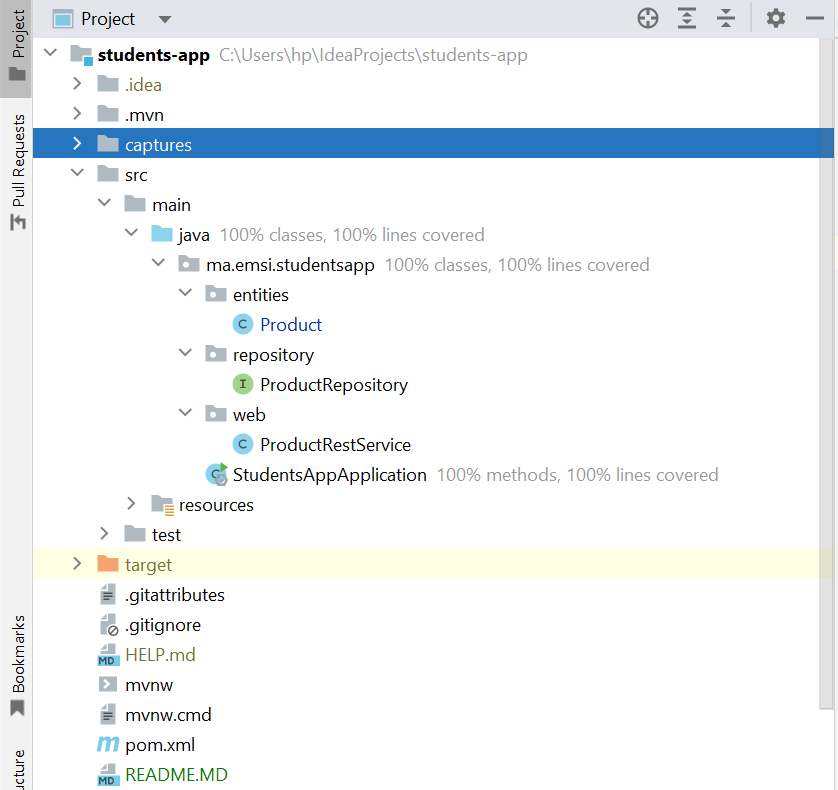
<h3> Voici la classe Product </h3>
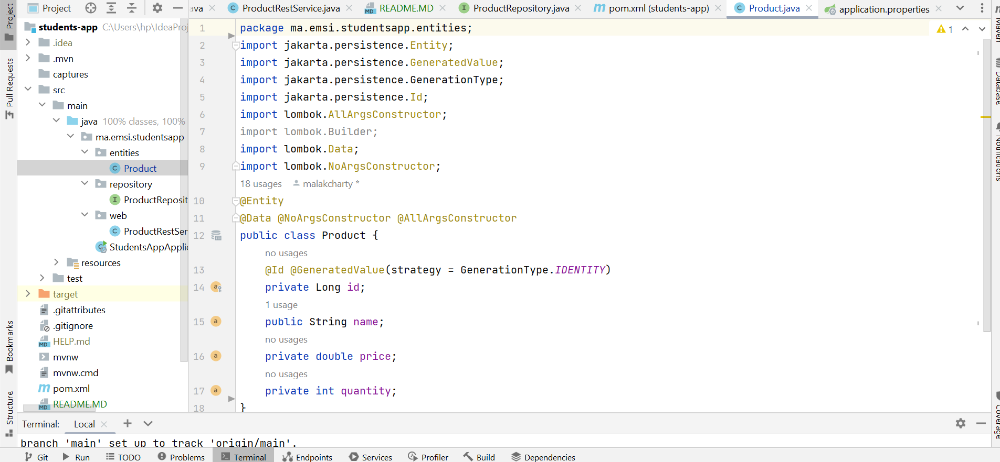
<h3> Voici l'interface ProductRepository </h3>
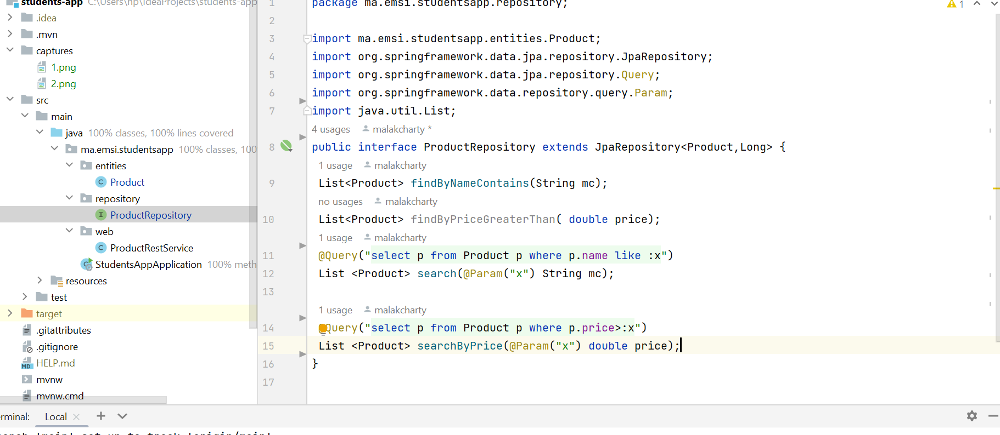
<h3> Voici StudentsAppApplication </h3>
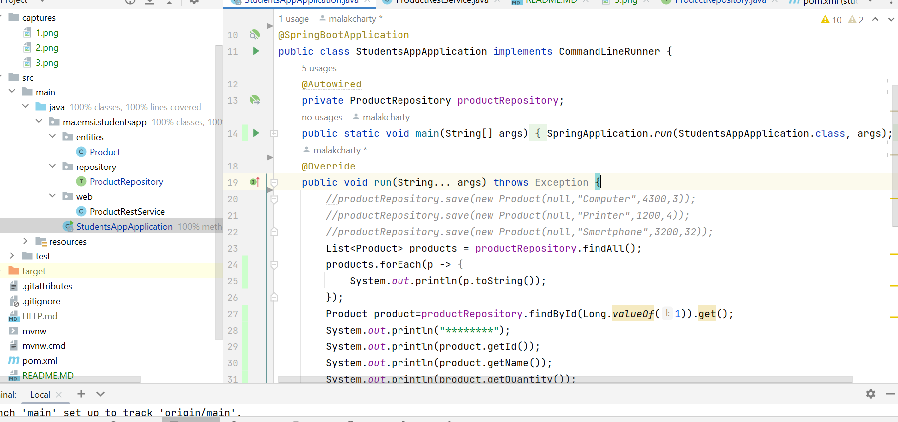
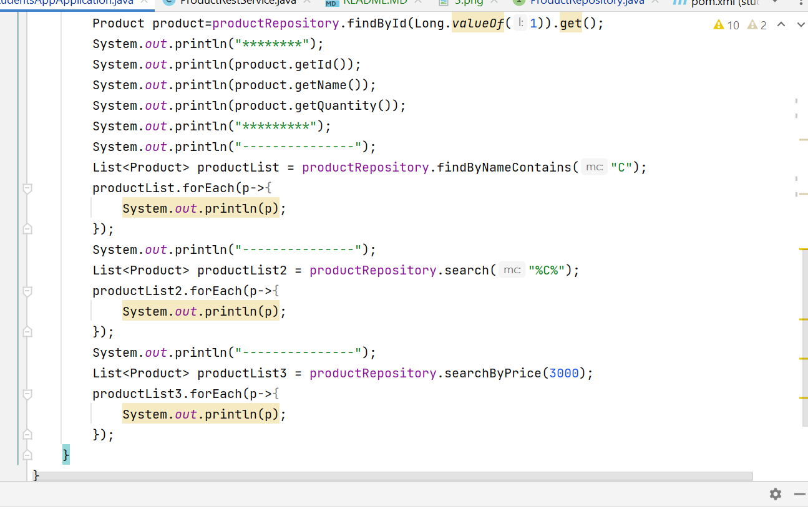
<h3> Voici application.propreties </h3>
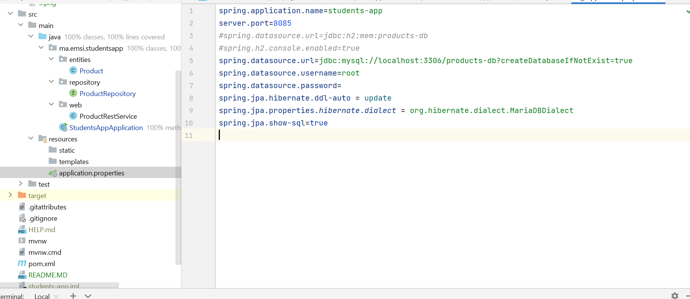
<h3> Voici le pom.xml </h3>
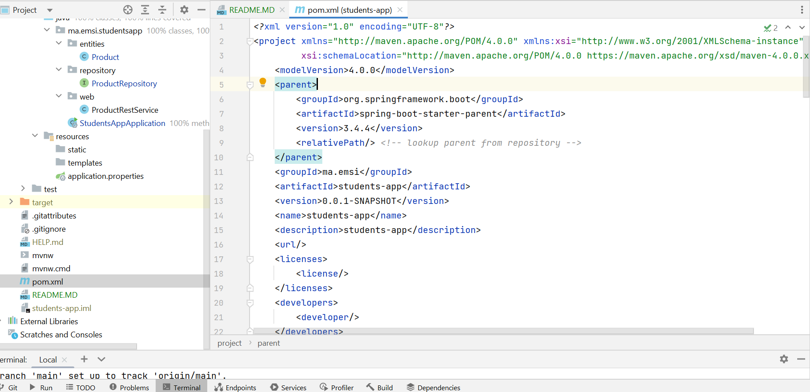
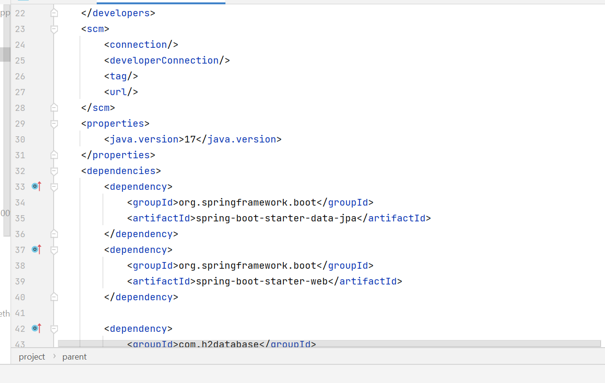
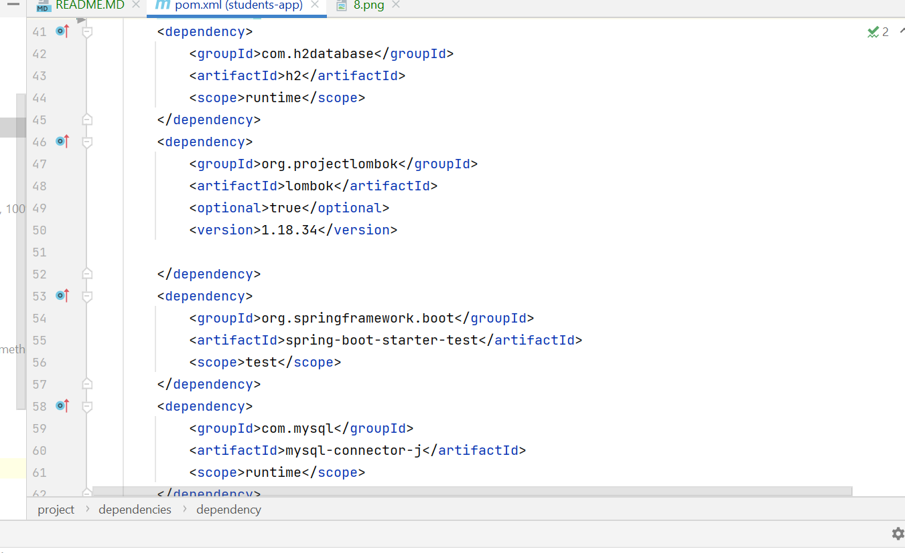
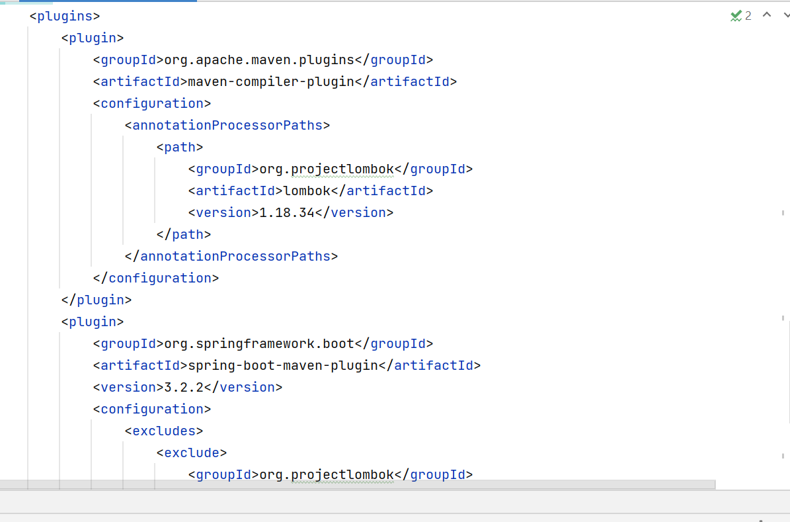
<h3> Liste de produits en utilisant  h2 </h3>
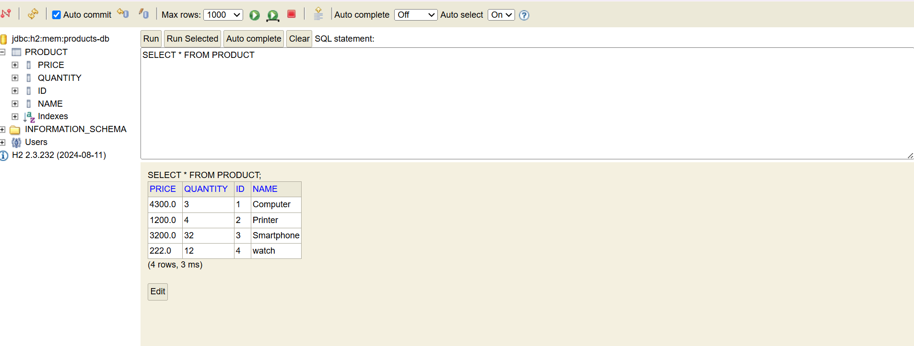
<h3> Liste de produits sous format Jason </h3>
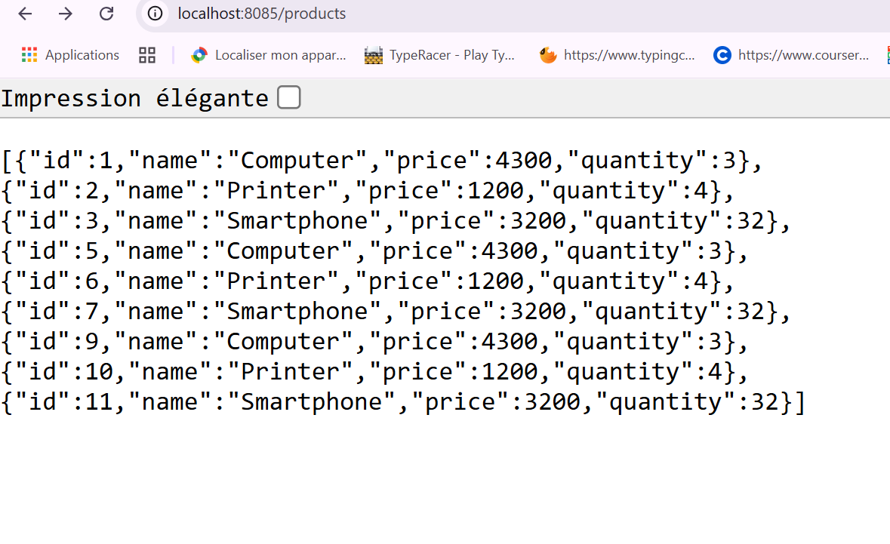
<h3> Liste de produits sous format Jason en specifiant l'id du produit qu'on souhaite affiché(id =1  ) </h3>
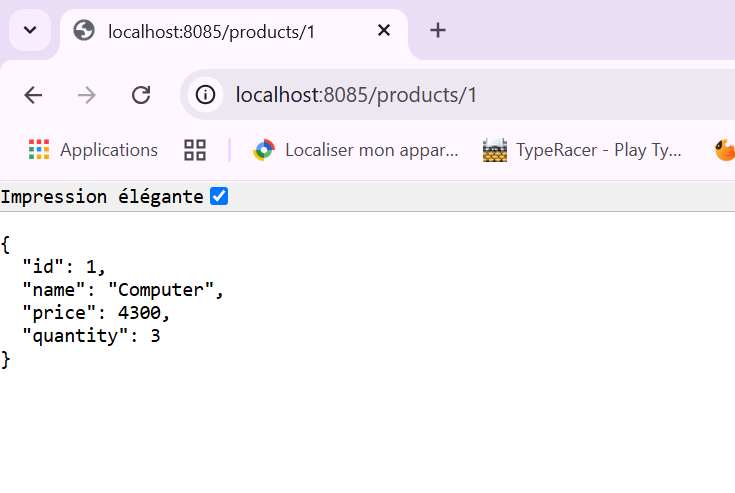
<h3> Sortie du projet  </h3>

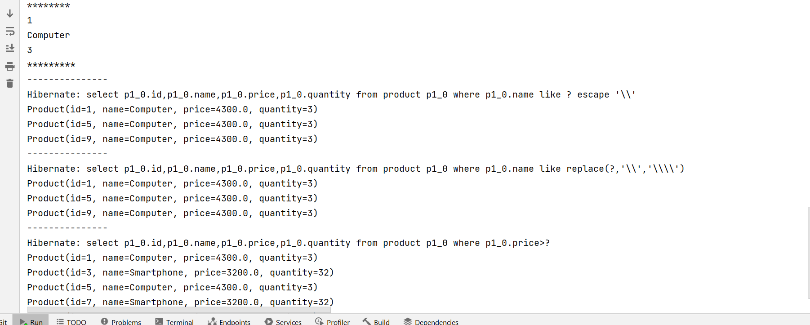
<h3> Liste de produits dans phpmyadmin</h3>
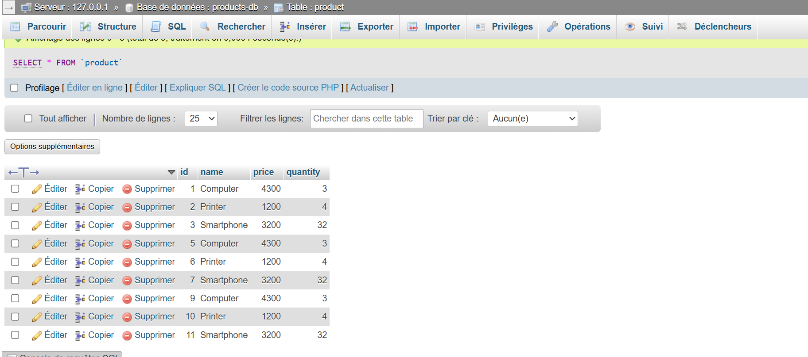
